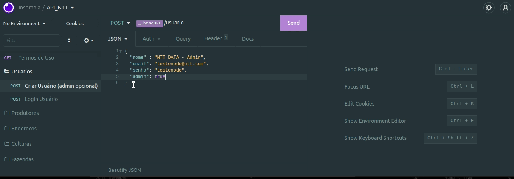
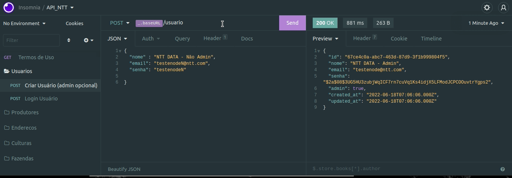
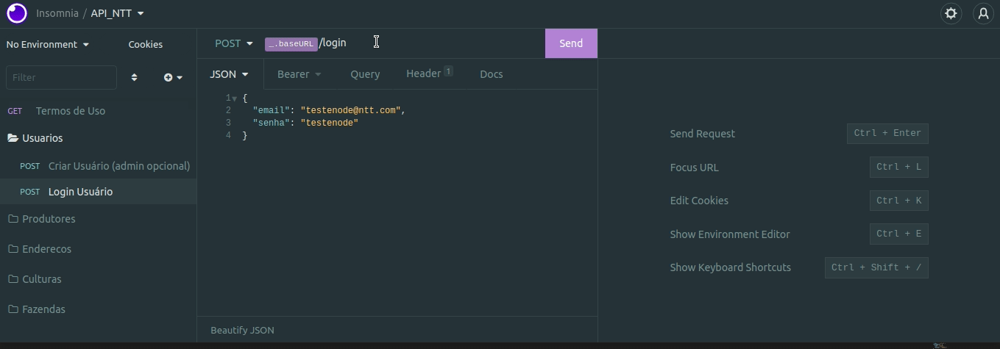
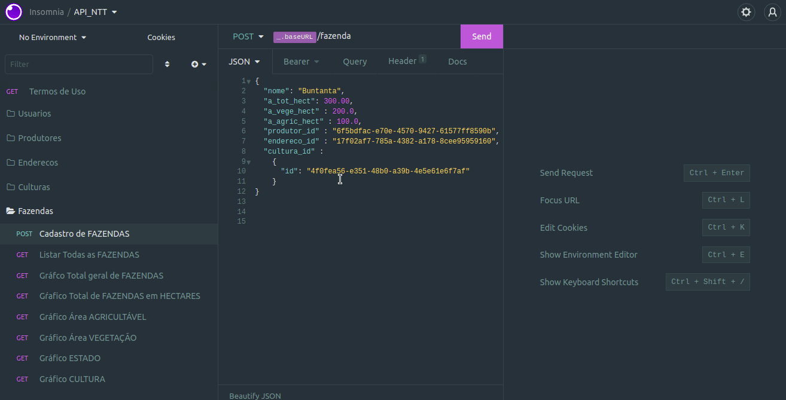

# 💻 Sobre o Projeto
<h3 align="center">
  Desafio NODEJS: Proposto pela <a href="https://github.com/brain-ag/trabalhe-conosco"> NTT DATA </a>
</h3>

___

  

  

## ✨ **Conteúdo**
- [💻 Sobre o Projeto](#-sobre-o-projeto)
  - [✨ **Conteúdo**](#-conteúdo)
- [🚀 Ferramentas e Tecnolgias Utilizadas para construção desta API](#-ferramentas-e-tecnolgias-utilizadas-para-construção-desta-api)
  - [🚧 Executar o projeto e testar no ambiente local](#-executar-o-projeto-e-testar-no-ambiente-local)
- [☕ Lógica desenvolvida para esta API](#-lógica-desenvolvida-para-esta-api)
  - [🚧 Arquitetura Utilizada no Projeto](#-arquitetura-utilizada-no-projeto)
    - [📝 **Bando de dados e ORM TypeORM**](#-bando-de-dados-e-orm-typeorm)
    - [📝 **Models**](#-models)
    - [📝 **Services**](#-services)
    - [📝 **Controllers**](#-controllers)
    - [📝 **Rotas**](#-rotas)
    - [📝 **Middlwares para válidação de Usuários Administradores e Autenticação nas Rotas**](#-middlwares-para-válidação-de-usuários-administradores-e-autenticação-nas-rotas)
  - [🚧 Cadastro de Usuários](#-cadastro-de-usuários)
  - [🚧 Realizar Login e Gerar Token de Login com validação de usuário e senha](#-realizar-login-e-gerar-token-de-login-com-validação-de-usuário-e-senha)
  - [🚧 Realizar Consultas em rotas disponíveis apenas para usuários com perfil administrador](#-realizar-consultas-em-rotas-disponíveis-apenas-para-usuários-com-perfil-administrador)
___

# 🚀 Ferramentas e Tecnolgias Utilizadas para construção desta API
  
  
  
  
   
  
  
    
  

____

## 🚧 Executar o projeto e testar no ambiente local
1. Faça o clone do projeto na sua máquina;
2. Na raiz do projeto, execute o comando `yarn` ou `npm install` para baixar as dependências;
3. Execute `npm run dev` para rodar o projeto em modo localhost;
4. Abra o `Insomnia` ou `PostMan` para testar as rotas informadas no arquivo routes disponível em `src/routes.ts` com os métodos `POST`,`GET`, `PUT` e `DELETE`, para isso, importe o arquivo `Insomnia_rotas_api.json` em: `src/insomnia`.
___

# ☕ Lógica desenvolvida para esta API
O Nucleo de pensamento para a criação desta API, está em torno da realização das operações de Inserção, Busca, Exclusão e Atualização com persistencia no banco de dados nas tebelas Usuário, Produtor, Endereçp, Cultura e Fazenda  das tabelas,utlização de middlware de validação de autenticação e perfil, podendo ser uma simulação de aplicação de uso gerencial.

 1. A aplicação possui usuários com perfis `administradores e não administradores`.
 2. Possui validações de campos existentes, presentes ou nulos nas rotas com `parametros na URL e na requisção`.
 3. É possível que qualquer tipo de perfil de usuário realize o `cadastro de outros usuários, produtos, cultivos, endereços ou fazendas`. 
 4. Só possível realizar as operações do item 2, após a confirmação do login `POST: http://localhost:3000/login` e a inseção do token gerado no `Bearer TOken` do simular de endpoints em que estiver utilizando.
 5. Os tipos de parametros utlizados são: 
    ``(vide arquivo de teste de EndPoints)``
      - `Query Params`
      - `Body Params` 
      - `Header Params`
     
 6. As requisições possuem os seguintes `ENDPOINTS`:
    
    ``(vide arquivo de teste de EndPoints)``
     - `-> POST | Inserção` 
     - `-> UPDATE | Alteração`
     - `GET | Listagem` 
     - `DELETE | Exclusão`
   
     
 7. Para o Cadastro de `Fazendas`, é necessário que préviamente sejam cadastrados `Produtores, Culturas, Endereços`. 
 8. No momento do cadastro de `FAZENDAS`, é necessário apenas que sejam passados os ids de `Produtores, Culturas, Endereços` (já pensando em como o frontend pode consumir e atribuír os valores no momento do cadastro de novas `FAZENDAS`).
 9.  para as operações de consultas aos `EndPoints dos Gráficos`, à nível de complexidade, `apenas os usuários com perfil administrador podem acessar os endpoints do item 8`, sendo necessário estar autenticado e validado.
 
## 🚧 Arquitetura Utilizada no Projeto
### 📝 **Bando de dados e ORM TypeORM**
  * Contém o apontamento para a criação do arquivo do banco de dados do SQLITE.
  * Contém o apontamento estrutural das tabelas com a execução das migrations.
  * Contém o arquivo de configuração para criar a conexão do typeORM
  * Não se preocupe, o banco de dados já está criado e está disponível em src/database.

  ### 📝 **Models**
  * Tem a responsabilidade de abstrair e refletir a monenclatura das tabelas existentes no banco de dados.
  
  ### 📝 **Services**
  * Contém a abstração da lógica de negócio pensada para a criação dos EndPoints da aplicação.
   
  ### 📝 **Controllers**
  * Realiza o controle de aplicação sobre os services.
  
  ### 📝 **Rotas**
  *  Contém o apontamento de todos os EndPoints da aplicação

  ### 📝 **Middlwares para válidação de Usuários Administradores e Autenticação nas Rotas**
  * Utlização de Middlware para validar a autenticação nas rotas.
  * Utlização de Middlware para validar o perfil do usuário nas rotas.
  * Utilização do Jsonwebtoken para criar token de autenticação.


## 🚧 Cadastro de Usuários

Na lógica da aplicação, é possível realizar o cadastro de usuários com os tipos "Administrador" ou Comun", sendo que usuários administradores são utilizados como `middleware` para visualizar as rotas de `Gráficos`, de acordo com a regra de negócio pensada(refinada) aplicada à esntrega deste teste.

* `Cadastro` de Usuário `Administrador`
```bash
# reports
  POST: http://localhost:3000/usuario
```



* `Cadastro` de Usuário `Comum`
```bash
# reports
  POST: http://localhost:3000/usuario
  Obs: Neste caso, baste omitir o parametro "admin" ou atribuir o valor "false".
```



## 🚧 Realizar Login e Gerar Token de Login com validação de usuário e senha
Após confirmados dados, é gerado o token para utilização nos demais `EndPoints` da aplicação.

```bash
# reports
  POST: http://localhost:3000/login
```


## 🚧 Realizar Consultas em rotas disponíveis apenas para usuários com perfil administrador

* Listar Rotas dos Gŕaficos



<p align="center">“Avalie com Carinho :). Eu Tentei rsrs</blockquote>

<p align="center">“Só deseje as coisas as quais você está disposto a lutar”!</blockquote>

Copyright :copyright: 2022 

[⬆ Voltar ao topo]
